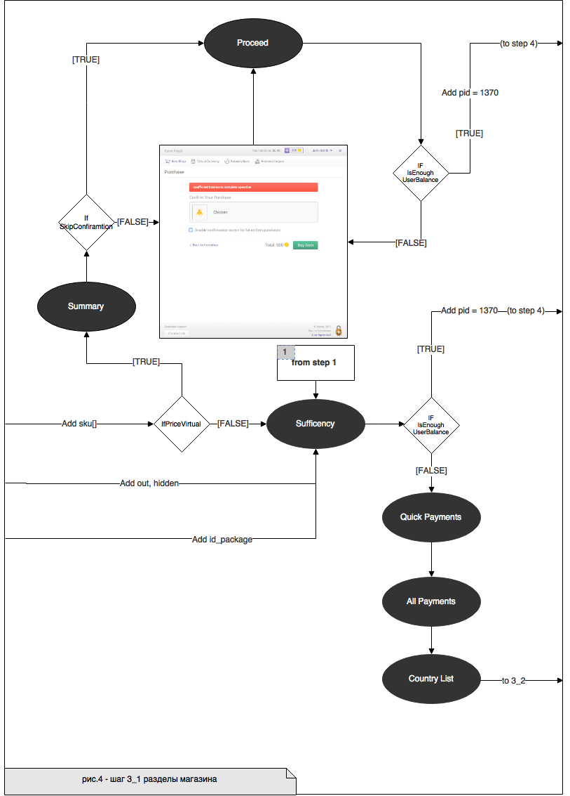

Здесь приведено описание SDK – библиотеки, которая реализует функционирование магазина на основе Paystation API. Предназначена для упрощения использования платежного решения Xsolla разработчиками альтернативных платформ.

* [Термины и определения](#термины-и-определения)
* [1. Цели создания](#1-цели-создания)
* [2. Функциональное назначение](#2-функциональное-назначение)
* [3. Варианты взаимодействия](#3-варианты-взаимодействия)
   * [3.1. Серверная интеграция](#31-серверная-интеграция)
   * [3.2. Упрощённая интеграция](#32-упрощённая-интеграция)
* [4. Процесс работы сервиса](#4-процесс-работы-сервиса)
   * [4.1. Общая схема работы](#41-общая-схема-работы)
      * [Шаг 1. Инициализирующий запрос](#шаг-1-инициализирующий-запрос)
      * [Шаг 2. Выбор покупки](#шаг-2-выбор-покупки)  
      * [Шаг 3. Выбор платежной системы](#шаг-3-выбор-платежной-системы) 


# Термины и определения
-   **Токен** – специальная шифрованная строка, необходимая для взаимодействия с Xsolla.
-   **sandbox** – специальный режим для безопасного исполнения и тестирования.
-   **Серверная интеграция** – интеграция и взаимодействие с Xsolla посредством специально настроенного сервера.
-   **Упрощённая интеграция** – взаимодействие только через клиент, сервер игры отсутствует.


# 1. Цели создания
- Сократить трудозатраты по внедрению платежного решения компании Xsolla за счет предоставления удобного инструмента для разработчиков.

- Упростить процесс взаимодействия с конечным пользователем за счет предоставления нативного инструмента, который содержит меньше (или исключает) дополнительные переходы на сторонние окна.

# 2. Функциональное назначение
Назначение библиотеки – получить полный функционал электронного магазина с модулями виртуальной валюты, виртуальных товаров, подписок и поддержкой множества платёжных методов, за счет использования всего одной функции.

Посредством взаимодействия с API должна быть реализована отрисовка магазина со всеми внутренними взаимодействиями, включающая в себя следующие экраны:
-   экран виртуальных товаров
-   экран виртуальной валюты
-   экран подписок
-   экраны выбора платёжных методов
-   экран оплаты
-   экран статуса
-   экран ошибки

# 3. Варианты взаимодействия
Реализовано два варианта взаимодействия с [Paystation API](https://secure.Xsolla.com/paystation2/api): в формате **POST** или **GET** запросов:
- **[Серверная интеграция](#31-серверная-интеграция)** – передаётся строка токена
- **[Упрощённая интеграция](#32-упрощённая-интеграция)** – передаётся JSON

## 3.1. Серверная интеграция
> Не хватает информации о строке токена, параметрах, как получить, использовать.
> Взаимодействие, настройки с сервером. Принцип работы варианта интеграции не описан.
> Не понятно нужен ли `CreateShop` для работы с токеном, есть ли возможность работы в _sandbox_,
> по описанию создается двусмысленное впечатление
> Возможно нужно еще разделы добавить Требования SDK, примеры привести 
## 3.2. Упрощённая интеграция

> Принцип работы варианта интеграции не описан. Не понятно в целом направленность изложения текста:
> для внешнего разработчика, кто будет использовать библиотеку или задание для внутреннего разработчика,
> кто создает библиотеку, которому необходимо знать зачем она и что внутри должно быть. Результаты работы
> функции, варианты ответов, ошибок возможных не известны


Для интеграции с использованием JSON используется специальный параметризированный объект или функция `CreateShop`.
Предусмотрена возможность взаимодействия с Xsolla API в режиме _sandbox_. Пользователь может определить, в каком режиме проводятся платежи.

### 3.2.1. Параметры `CreateShop`
Параметр |Формат| Применение | Описание
--- | --- | ---| ---
`token` |`string` |обязательный, но либо `token` либо `json`| Токен
`json`  |`json` |обязательный, но либо `token` либо `json`| `json`
`isSandbox`| `bool` | обязательный |  Возможность работы в режиме _sandbox_ (при передаче true).  В URL перед secure добавляется `sandbox-`.
`OkCallback`|Реализуется любым удобным способом, не обязательно в виде параметра |обязательный|Возможность обработать успешный платёж
`ErrorCallbck`|Реализуется любым удобным способом, не обязательно в виде параметра|обязательный|Возможность обработать платёж с ошибкой

После вызова данной функции управление процессом работы приложения со стороны разработчика-пользователя заканчивается и переходит под управление библиотеки.

Контроль над работой приложения разработчик получает вновь лишь в момент успешного или неуспешного завершения платежа.

### 3.2.2. Параметры JSON
> Возможно необходимо описание параметров более подробное
```JSON
{
   "user": {
       "id": {
           "value": 0
        },
        "name": "",
        "email": "",
        "country": {
           "value": "",
            "allow_modify": false
        }

    },

    "settings": {
       "project_id": 0,
        "language": "",
        "currency": "",
        "mode": "sandbox",
        "secretKey": ""
    }
}
```


# 4. Процесс работы сервиса

## 4.1. Общая схема работы
Общая схема взаимодействия ([рис. 1](#общая-схема-работы-с-paystation-api)) с [Paystation API](https://secure.Xsolla.com/paystation2/api) включает в себя 5 основных шагов:
№ шага| Описание | Выполнение
---| --- | --
1  | [Инициализирующий запрос](#шаг-1-инициализирующий-запрос) | обязательно
2  | [Выбор покупки](#шаг-2-выбор-покупки)  |  не обязательно
3  | [Выбор платежной системы](#шаг-3-выбор-платежной-системы)  |  не обязательно
4  | Проведение платежа  | обязательно
5  | Cтатус покупки  |  обязательно


Вся информация, необходимая для определения схемы магазина, может быть получена из инициализирующего запроса.

Далее рассмотрим каждый из этих шагов в отдельности, описание состоит из текстового описания и диаграмм, наглядно иллюстрирующих процесс работы сервиса.

- Порядок запросов и переходов описан в разделе [Общая схема работы](https://docs.google.com/document/d/1gkqvf-70VZHFr3O0LbyK6VzTYDlng5b43ewYcwWszlA/edit#heading=h.amr87j4qq6ju).
- Построение интерфейса и обработка запросов описана в разделе [Обработка запросов](https://docs.google.com/document/d/1gkqvf-70VZHFr3O0LbyK6VzTYDlng5b43ewYcwWszlA/edit#heading=h.7xpc6mcqgzk4).
- Описание дизайна находится в разделе [Дизайн](https://docs.google.com/document/d/1gkqvf-70VZHFr3O0LbyK6VzTYDlng5b43ewYcwWszlA/edit#heading=h.761yukuyrfxl).

 <a name="общая-схема-работы-с-paystation-api"></a>
 


### Шаг 1. Инициализирующий запрос

Инициализирующим запросом является запрос
[Utils](https://docs.google.com/document/d/1gkqvf-70VZHFr3O0LbyK6VzTYDlng5b43ewYcwWszlA/edit#heading=h.ws7e5kigc9gf) 
из него можно получить всю необходимую информацию для работы сервиса. 

В своём ответе он включает:
- [Информацию о пользователе](https://docs.google.com/document/d/1gkqvf-70VZHFr3O0LbyK6VzTYDlng5b43ewYcwWszlA/edit#heading=h.6er2sxdhh14m),
- [Информацию о проекте](https://docs.google.com/document/d/1gkqvf-70VZHFr3O0LbyK6VzTYDlng5b43ewYcwWszlA/edit#heading=h.uqcfppu7xv8k),
- [Информацию о покупке](https://docs.google.com/document/d/1gkqvf-70VZHFr3O0LbyK6VzTYDlng5b43ewYcwWszlA/edit#heading=h.63r8vdmbvq3u),
- [Настройки](https://docs.google.com/document/d/1gkqvf-70VZHFr3O0LbyK6VzTYDlng5b43ewYcwWszlA/edit#heading=h.1qvv5bfeuj61)
- [Переводы](https://docs.google.com/document/d/1gkqvf-70VZHFr3O0LbyK6VzTYDlng5b43ewYcwWszlA/edit#heading=h.d5pbgdclyfqy).

После получения корректного ответа от сервера в первую очередь нас интересует
[Информация о покупке](https://docs.google.com/document/d/1gkqvf-70VZHFr3O0LbyK6VzTYDlng5b43ewYcwWszlA/edit#heading=h.63r8vdmbvq3u) 
с помощью неё определяется передана ли покупка (`purchase`).

Если да, то необходимо проверить наличие товара (`virtual_currency`, `virtual_items`, `subscription` или `subscription`) и наличие платёжной системы (`payment_system`).
Это необходимо для определения дальнейших шагов, так, если в ответе содержится товар, то следует пропустить шаг № 2 ([рис. 1](#общая-схема-работы-с-paystation-api)), 
если же содержится платёжная система, то следует пропустить шаг № 3 ([рис. 1](#общая-схема-работы-с-paystation-api)).

Схема запроса представлена на [рис. 2](#инициализация).
> Здесь и дальнейших рисунках название параметров с приведенными по тексту не совпадает, например: paymentSystem, если используются методы ISGoodsAtFirst для получения значения параметров, то это тоже сбивает с толку, описывать тогда или значения или применяемые методы с результатами

Здесь уже начинается построение интерфейса так как уже на этом этапе имеются все данные для построения шапки (header) и подвала (footer) окна магазина.

 <a id="инициализация"></a>


### Шаг 2. Выбор покупки

Выбор покупки это второй шаг, если перед этим мы не получили товар (`virtual_currency`, `virtual_items`, `subscription` или `subscription`).
Задача – построить магазин в котором пользователь сможет выбрать понравившийся ему товар и продолжить свою покупку.

В первую очередь используется информация из [инициализирующего запроса](#инициализирующий-запрос). 

Нас интересуют поля из объекта
[настроек](https://docs.google.com/document/d/1gkqvf-70VZHFr3O0LbyK6VzTYDlng5b43ewYcwWszlA/edit#heading=h.1qvv5bfeuj61) (`settings`):
- `goods_at_first`
- `pricepoints_at_first`
- `subscriptions_at_first`

их значения могут быть **0** или **1**.

В зависимости от ответа – отображаются те или иные пункты меню/категории для пользователя:
- [Товары](https://docs.google.com/document/d/1gkqvf-70VZHFr3O0LbyK6VzTYDlng5b43ewYcwWszlA/edit#heading=h.94e9kocxokka)
- [Вирт валюта](https://docs.google.com/document/d/1gkqvf-70VZHFr3O0LbyK6VzTYDlng5b43ewYcwWszlA/edit#heading=h.u0crnbhvhxdh)
- Подписки

Далее пользователь выбирает какой либо из товаров и использует один их двух вариантов: 
- [покупка за реальную валюту](#покупка-за-реальную-валюту) 
- [покупка за виртуальную валюту](#покупка-за-виртуальную-валюту)

> Не хватает описания для рисунков, что именно иллюстрируют? Названия рис. не совсем соответствуют

<a id="открытие_магазина"></a>


<a id="навигация"></a>


### Шаг 3. Выбор платежной системы
#### Покупка за реальную валюту

В случае покупки за реальную валюту сразу осуществляется переход к проверке пользовательского баланса, если баланса достаточно оплата продолжается через **Xsolla Balance**, в ином случае происходит открытие списка платёжных систем.

#### Покупка за виртуальную валюту

При покупке за виртуальную валюту сперва выполняется запрос **Summary**, в котором находится содержимое нашей покупки и метка, которая говорит можно ли пропустить подтверждение от пользователя, если да, то переход осуществляется к следующему запросу **Proceed**, который может нам вернуть ошибку либо ничего не вернуть и тогда платеж продолжается опять через **Xsolla Balance**.
Если вернулась ошибка или необходимо подтверждение от пользователя то мы попадем на экран подтверждения платежа на котором пользователю будет показана:
- его покупка,
- чекбокс `"спрашивать ли подтверждение в следующий раз"`,
- ошибка, если вернулись сюда после запроса **Proceed**.

> Не хватает ссылок на описание запросов Summary, Proceed в тексте
> Подпись рисунка не совсем соответствует


<a id="выбор_платежки"></a>


